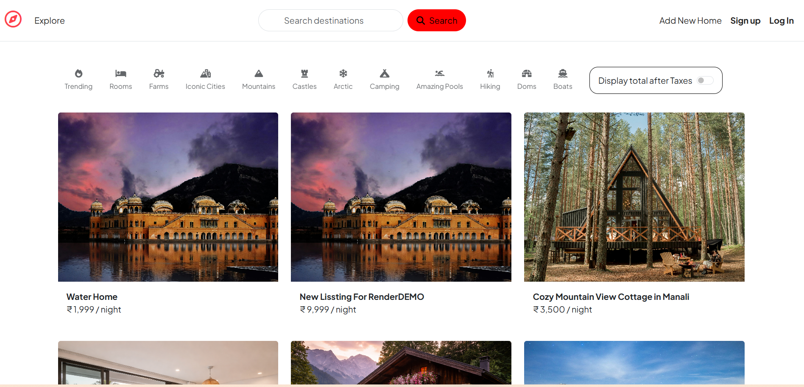
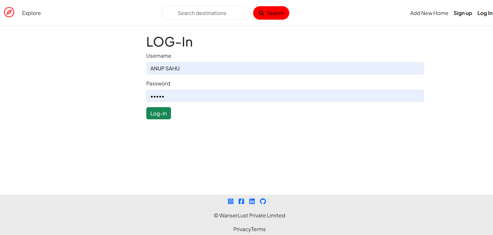

# Wanderlust

# 🌍 Wanderlust - Travel Listing Web App

Wanderlust is a full-stack travel listing web application that allows users to explore, create, and manage travel destinations. This project demonstrates backend development, routing, and real-world application structure.

---

## 🚀 Features

- 🏕️ Create, edit, and delete travel listings
- 📍 Explore destinations
- 🧾 Structured backend with Express.js
- 🐞 Bug reporting system (QA-focused feature)
- 🔐 User-related route handling

---

## 🛠️ Tech Stack

- Frontend: HTML, CSS, JavaScript
- Backend: Node.js, Express.js
- Database: MongoDB (if used)
- Version Control: Git & GitHub

---

## 📁 Project Structure

Wanderlust/
│
├── Bug-report/
│ └── wanderlust-bug-reports.md
│
├── classroom/
│ ├── routes/
│ │ ├── post.js
│ │ └── user.js
│ └── server.js
│
├── .gitignore
├── package.json
└── README.md

## 📸 Screenshots

  

  

