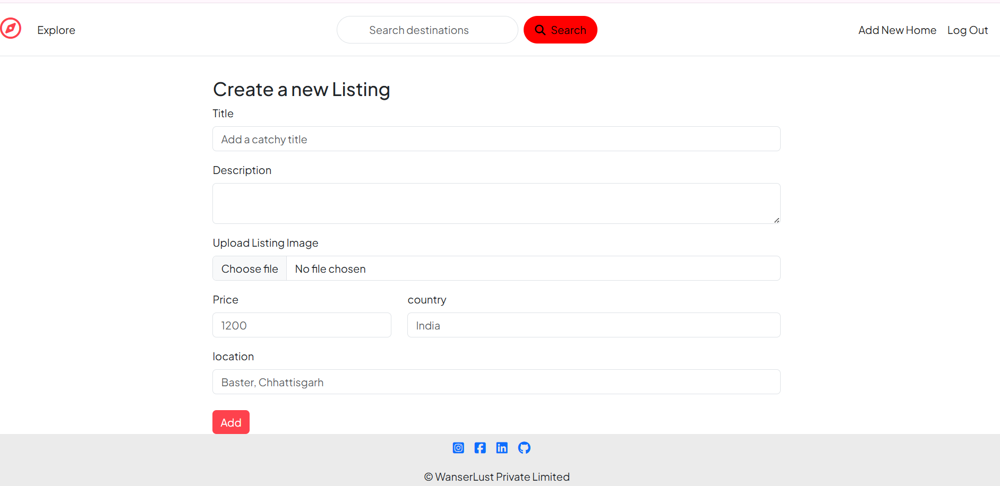

# 🌍 Wanderlust — Travel Listing Web Application

Wanderlust is a full-stack travel listing web application that allows users to explore, create, and manage travel destinations. The project demonstrates practical backend development, structured routing, and real-world debugging workflows.

---

## 🚀 Live Project

🔗 GitHub Repository:
https://github.com/SuperANUP07/Wanderlust

*(Add deployed link here if available — highly recommended)*

---

## ✨ Key Features

* 🏕️ Create, edit, and delete travel listings
* 📍 Explore destinations with structured data
* 🧾 RESTful API routing using Express.js
* 🐞 Dedicated bug reporting system (QA-focused)
* 📂 Organized backend architecture
* 🔄 Version-controlled development using Git

---

## 🛠️ Tech Stack

| Category        | Technology Used           |
| --------------- | ------------------------- |
| Frontend        | HTML, CSS, JavaScript     |
| Backend         | Node.js, Express.js       |
| Database        | MongoDB *(if configured)* |
| Version Control | Git, GitHub               |

---

## 📁 Project Structure

```
Wanderlust/
│
├── Bug-report/
│   └── wanderlust-bug-reports.md
│
├── classroom/
│   ├── routes/
│   │   ├── post.js
│   │   └── user.js
│   └── server.js
│
├── screenshots/        # Add project images here
├── .gitignore
├── package.json
└── README.md
```

---

## ⚙️ Installation & Setup

### 1️⃣ Clone the repository

```bash
git clone https://github.com/SuperANUP07/Wanderlust.git
cd Wanderlust
```

### 2️⃣ Install dependencies

```bash
npm install
```

### 3️⃣ Run the server

```bash
node classroom/server.js
```

---

## 📸 Screenshots

*(Add screenshots in `/screenshots` folder and update below)*

### 🏠 Homepage


### 📝 Create Listing



### 📍 Listings Page


---

## 🐞 Bug Reporting (QA Highlight)

This project includes a structured bug tracking file:

📄 `Bug-report/wanderlust-bug-reports.md`

It demonstrates:

* Bug identification
* Reproduction steps
* Expected vs actual behavior
* Structured QA documentation

---

## 🎯 Future Enhancements

* 🔐 Authentication (JWT / Sessions)
* 🌐 Deployment (Render / Vercel / Railway)
* 🗺️ Maps & location integration
* 📷 Image upload support
* 🎨 UI/UX improvements

---

## 👨‍💻 Author

**Anup Sahu**
📧 [cryptrion99@gmail.com](mailto:cryptrion99@gmail.com)
🔗 https://github.com/SuperANUP07

---

## ⭐ Contribution

Contributions, issues, and feature requests are welcome!

---

## 📌 Note

This project is part of a hands-on learning journey in full-stack development and software testing, with a strong focus on real-world debugging and QA practices.
